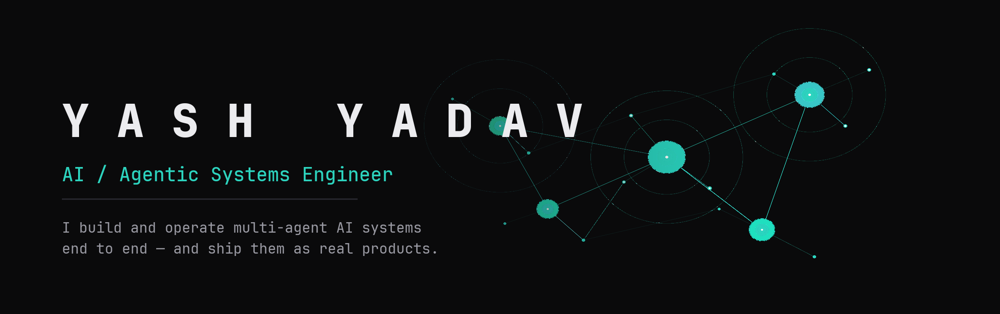

<!--
  GENERATED by nhq-profile-sync — do not hand-edit.
  Source: portfolio/src/data/*.ts · regenerate with `nhq-profile-sync`.

  To publish: create a public repo named exactly `yashyadav711`
  (github.com/yashyadav711/yashyadav711) and copy BOTH this README.md and
  banner.png into it. Then pin your public repos.
-->

 

---

AI / agentic systems engineer and full-stack operator. Ex-Information Security Consultant (DevSecOps, 40+ audits across government & enterprise) who now designs, builds, and runs multi-agent AI products end to end — infra, backend, frontend, deploy, and prod ops.

<table>
<tr>
<td align="center"><b>40+</b> security audits</td>
<td align="center"><b>Gov+Ent</b> deployments</td>
<td align="center"><b>AWS</b> SAA + CLF certified</td>
<td align="center"><b>2 yrs</b> DevSecOps</td>
</tr>
</table>

---

## What I'm building

### Agentic Conversation Platform
**Multi-tenant agentic conversation platform, live in production.** &nbsp;·&nbsp; `Live`

- One isolated worker + SQLite store per configured agent — hundreds run without cross-talk.
- Voice pipeline: cloning, denoise, room-tone, TTS/STT with billing caps.
- Crypto checkout + operator console: monitor, takeover, funnel editor, analytics.

`FastAPI` `Telethon` `Next.js 16` `React 19` `Supabase / Postgres` `Railway` `ElevenLabs` `Prometheus`

### Multi-Agent Operating Layer
**An operating layer for running multi-agent development fleets safely.** &nbsp;·&nbsp; `In production`

- Files-as-truth fleet model with seven lifecycle states — no trusting chat memory.
- Governance: typed safety gates, hash-chained audit log, reversible-action guards.
- Resource-aware ops tuned for a 7.5 GB laptop: admission control, RAM-aware reaping, token/cost accounting.

`Python` `Bash` `SvelteKit` `SQLite (WAL)` `tmux` `systemd`

### Multi-Tenant Automation Backend
**Multi-tenant automation backend — tenant isolation, queues, reliability.** &nbsp;·&nbsp; `WIP` `confidential`

- 16-table tenant-isolated schema; every row carries tenant_id; database-enforced RLS.
- Async job queue over Postgres LISTEN/NOTIFY; provisioning API with status polling.
- Browser-worker fleet with per-session isolation, pacing/humanization for reliability.

`FastAPI` `SQLAlchemy + Alembic` `Supabase / Postgres` `Postgres LISTEN/NOTIFY` `Selenium` `Railway`

### Anvil — AI Coding-Tool Security Control Plane
**Security control plane for the AI coding tools running on a dev fleet.** &nbsp;·&nbsp; `WIP`

- Detects and audits seven agent families — Claude Code, Cursor, Copilot, Cline, Windsurf, Zed, MCP.
- Rule findings map to SOC 2 controls (CC6.1, CC7.1…) and carry a one-command remediation.
- Offline-first free tier: packs bundled into the binary, no account, no network — macOS, Linux, Windows.

`Go` `Next.js` `React` `Radix UI` `Supabase` `Sentry` `pnpm workspaces`

---

## Selected work

| Project | What it is | Built with |
|---|---|---|
| **Autonomous Build Platform** | Host-embeddable autonomous multi-agent build service. | `TypeScript` `Hono` `Node/WebSockets` `Next.js` |
| **Human-Governed Agent Framework** | Human-governed multi-agent development framework. | `Claude Code` `Markdown-as-config` `Bash` `Templates` |
| **Synthetic-Identity Engine** | Deterministic synthetic-identity API with referential consistency. | `Python` `FastAPI` `Pydantic v2` `Docker` |
| **On-Chain Pay-Per-Request API** | On-chain pay-per-request pricing API (x402 / USDC on Base). | `TypeScript` `Express` `ethers v6` `Redis` |
| **Planner Suite** | Android app that generates digital-planner PDFs with working tap navigation. | `Kotlin` `Jetpack Compose` `Gradle` `SQLite` |

<b>Everything else</b> — 7 more projects

 

| Project | What it is | Built with |
|---|---|---|
| **Privacy-First SaaS Metrics** | Privacy-first SaaS-metrics & investor one-pager (browser-only). | `React` `Vite` `TypeScript` `Vitest` |
| **Bilingual AI Deck-Analysis SaaS** | Bilingual AI pitch-deck analysis SaaS. | `Next.js 14` `TypeScript` `Supabase` `Anthropic` |
| **AI Conversation QA Harness** | Behavioral AI-conversation QA / evaluation harness. | `Python` `httpx` `SSE` `pytest` |
| **On-Device AI Capture App** | On-device AI capture app + LAN agent-status hub. | `Kotlin` `Jetpack Compose` `Whisper` `Gemma` |
| **Gemma LoRA Fine-Tune** | LoRA fine-tune of Gemma for English→Hinglish. | `Transformers` `TRL` `PEFT/LoRA` `Modal` |
| **Reproducible Dev Workstation** | Reproducible Arch/Hyprland AI-builder workstation. | `Bash` `Fish` `Hyprland` `systemd` |
| **Multilingual Telegram Bridge** | Multilingual Telegram bridge (text + voice). | `Python` `NVIDIA NIM` `Whisper` `Groq` |

---

## Stack

| | |
|---|---|
| **Languages** | `TypeScript` `Python` `Go` `Kotlin` `Java 17` `SQL` `JavaScript / Node.js` |
| **AI / ML / LLM** | `OpenAI-compatible APIs` `Anthropic (Claude)` `Google Gemini / Vertex AI` `MediaPipe (on-device Gemma)` `PyTorch` `Hugging Face (Transformers · Datasets)` `TRL + PEFT / LoRA` `Modal · Lightning AI (GPU)` `ElevenLabs (voice clone)` `Whisper · Sherpa-ONNX (STT)` `Selenium (agentic browser)` |
| **Frontend** | `React` `Next.js` `Astro` `SvelteKit` `Vite` `Tailwind CSS` `TanStack Query` `React Hook Form + Zod` `next-intl (i18n)` `Jetpack Compose / Material 3` |
| **Backend** | `FastAPI + Uvicorn` `Hono` `Express` `Django + DRF` `WebSockets` `Telethon / python-telegram-bot` `Stripe` `ethers (Base / USDC)` |
| **Data & Storage** | `PostgreSQL` `Supabase` `Redis` `SQLAlchemy + Alembic` `Postgres LISTEN/NOTIFY queue` `Celery` |
| **Infra / DevOps / Cloud** | `Docker + Compose` `Railway` `GitHub Actions` `GHCR` `Nginx` `Prometheus` `Sentry` `AWS (boto3 · SAA-C03)` `structlog / Pino` |
| **Security / DevSecOps** | `Fernet / cryptography` `JWT` `Argon2` `Rate limiting (slowapi)` `Row-Level Security` `TruffleHog` `Trivy` `pip-audit / npm audit` `Hash-locked deps (uv · pip-compile)` |
| **Testing & Quality** | `pytest (+asyncio · httpx)` `Testcontainers · Hypothesis` `Vitest` `Playwright + axe (a11y)` `Jest + Supertest` `Ruff + Pyright` `ESLint · mypy · Black` |
| **Tooling** | `pnpm / npm` `Turborepo` `uv` `Gradle` `Husky` `pre-commit` `tsx` |

---

## Before AI: security & DevSecOps

- 40+ security audits, including high-security government & enterprise deployments.
- DevSecOps & cloud security automation: ELK log analysis, threat intel, CAPEv2 malware-analysis setup, system hardening (CIS), CI/CD with GitLab + Jenkins.

`AWS Solutions Architect — Associate (SAA-C03)` · `AWS Certified Cloud Practitioner (CLF-C01)` · `RHCSA (Red Hat System Administration)` · `CRTP (in progress)`

---

B.Tech, Computer Science & Engineering (Hons., Cyber Security) · Lovely Professional University, Jalandhar 
India · Remote-first · <a href="mailto:yashyadav711@yahoo.in">yashyadav711@yahoo.in</a>

